# 🛒 電子商務分析 Power BI 專案

這是一個專為電子商務數據打造的 Power BI 報表範本。透過此範本，您可以快速掌握銷售趨勢、產品表現與客戶分布。

---

## 📥 檔案下載

### 1. 下載 Power BI 範本 (.pbit)
請點擊下方連結下載報表結構檔案：
* [**下載 我的作品.pbit**](#)  
  *(註：.pbit 檔案僅包含報表設計，不含實際數據，需手動串接下方資料源)*

### 2. 下載範例資料 (.csv)
請下載此 CSV 檔案作為報表的數據來源：
* [**下載 Sales_csv.csv**](#)

---

## 🚀 使用方式

請遵循以下步驟完成資料夾路徑設定，以正常顯示圖表：

### 步驟 1：開啟範本
雙擊開啟 **「我的作品.pbit」**。

### 步驟 2：輸入資料來源路徑
開啟檔案後，Power BI 會自動偵測到遺失的路徑，並彈出 **「資料來源提示」** 視窗（或進入「資料轉換」參數頁面）。

### 步驟 3：路徑對接
在路徑輸入框中，請輸入您 **「解壓縮後的 Sales_csv.csv」** 完整的電腦路徑。

> **💡 範例路徑參考：**
> `C:\Users\Username\Downloads\Sales_csv.csv`

### 步驟 4：套用變更
點擊「載入」或「套用變更」，系統將自動讀取 CSV 資料並生成視覺化分析結果。

---

# 📊 報表預覽
## 1. 首頁與導覽 (Home & Navigation)

系統主入口，提供快速導航與關鍵指標概覽。

| 頁面名稱 | 功能描述 | 預覽圖示 |
| :--- | :--- | :---: |
| **首頁 (Home)** | 顯示全公司即時關鍵績效指標 (KPI)、最新公告與快速入口。 |  |
| **導覽頁 (Navigation)** | 樹狀結構選單，可快速切換至店面、線上或報表分析模組。 | 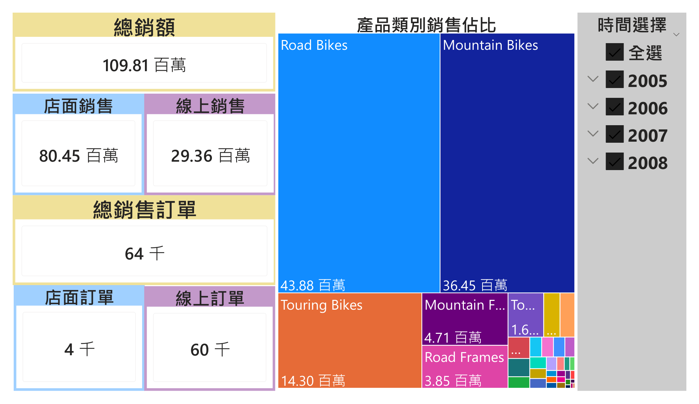 |

---

## 2. 店面銷售分析 (Store Sales Analysis)

針對實體店面的詳細銷售數據追蹤。

| 報表項目 | 數據維度說明 | 圖表預覽 |
| :--- | :--- | :---: |
| **店面年度銷售** | 比較各分店全年總營收與年增率 (YoY)。 | 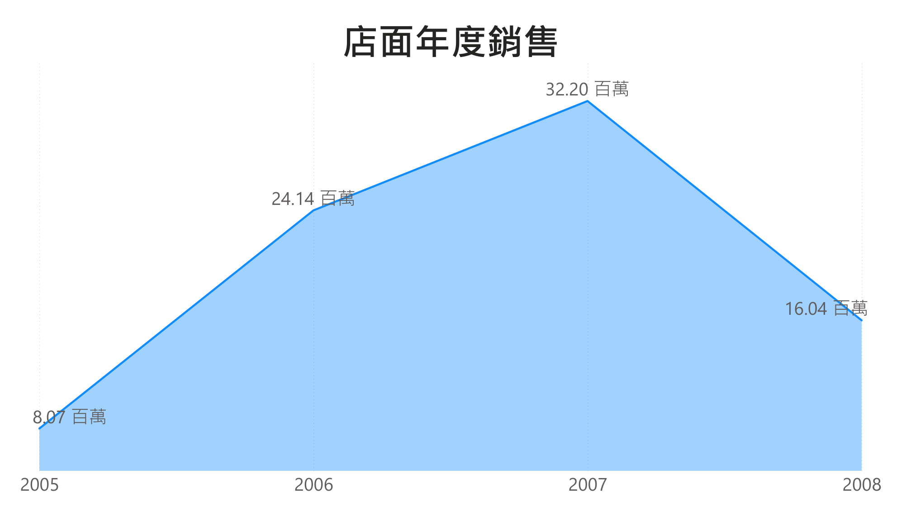 |
| **店面每月銷售** | 單一或多店別的月度銷售趨勢折線圖。 | 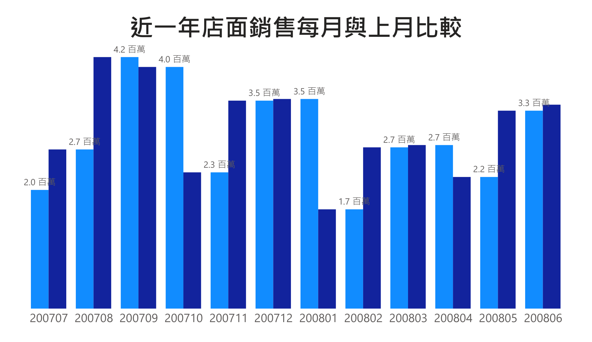 |
| **店面各類別銷售** | 店內商品類別佔比圓餅圖 (如：服飾、電子、食品)。 | 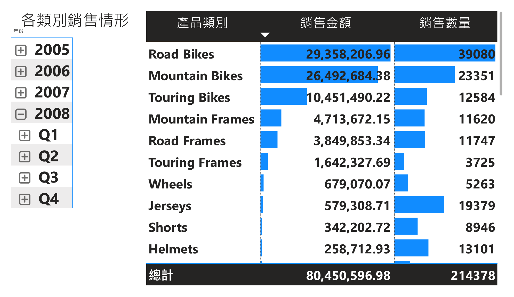 |
| **店面排行榜** | 依據業績或客流量進行的門店排名列表。 | 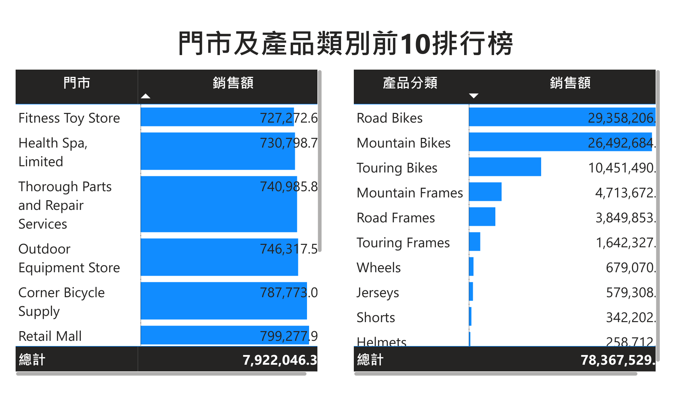 |

---

## 3. 線上銷售分析 (Online Sales Analysis)

針對電商平台與網路渠道的銷售數據追蹤。

| 報表項目 | 數據維度說明 | 圖表預覽 |
| :--- | :--- | :---: |
| **線上年度銷售** | 電商平台全年營收總覽與季度成長分析。 | 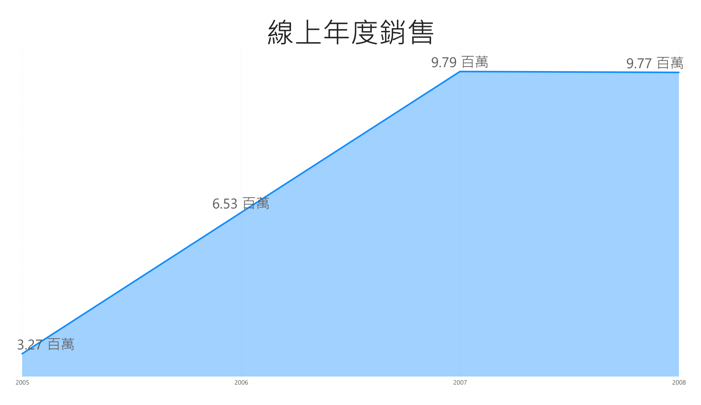 |
| **線上每月銷售** | 網站流量轉換率與月度訂單量趨勢。 | 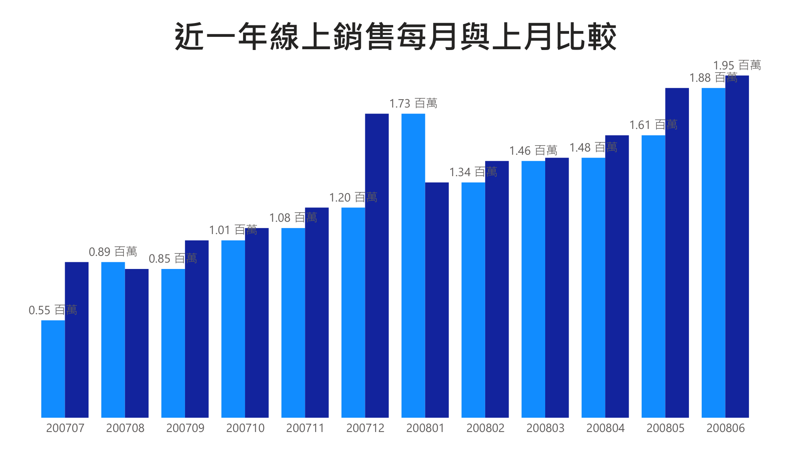 |
| **線上各類別銷售** | 熱門搜尋關鍵字與網路熱銷品項分析。 | 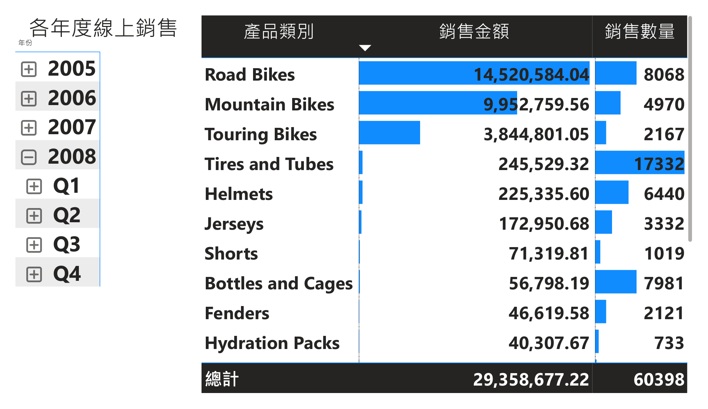 |
| **線上排行榜** | 單品銷售冠軍與高回購率商品排名。 | 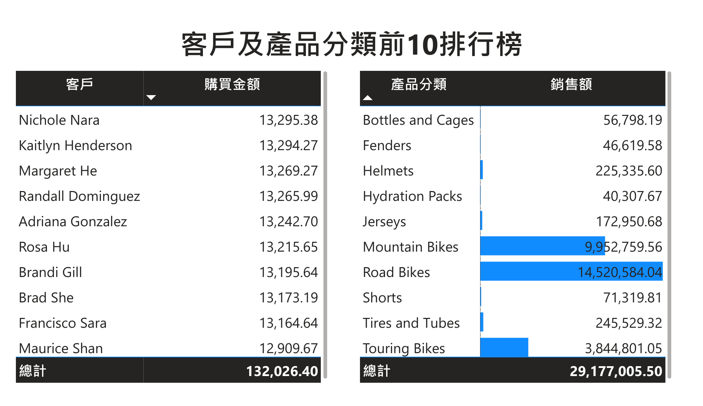 |

---

## 4. 全公司銷售整合 (Company-Wide Overview)

整合實體與線上渠道的宏觀數據。

| 報表項目 | 數據維度說明 | 圖表預覽 |
| :--- | :--- | :---: |
| **全公司年度銷售** | 集團總營收、淨利與各渠道貢獻比例。 | 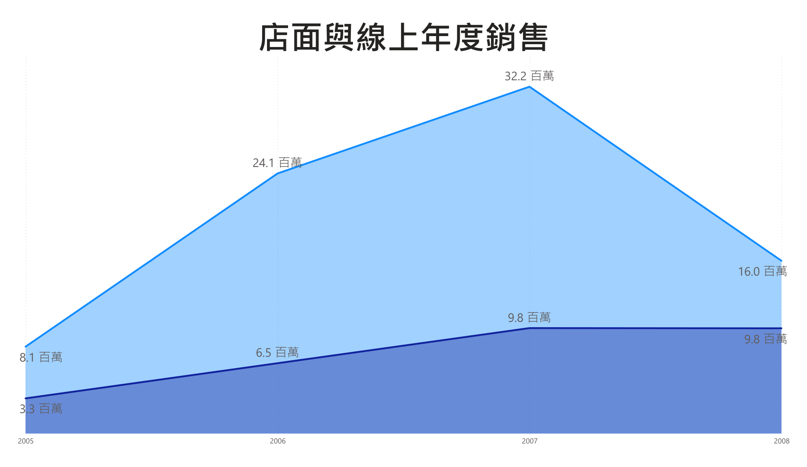 |
| **全公司每月銷售** | 整體營運現金流與月度目標達成率儀表板。 | 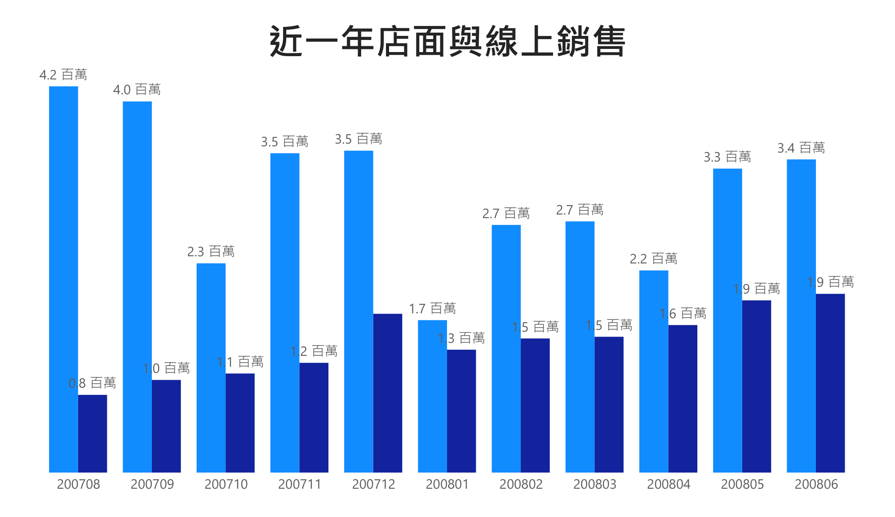 |
| **全公司排行榜** | 跨渠道綜合績效排名 (最佳區域/最佳團隊)。 | 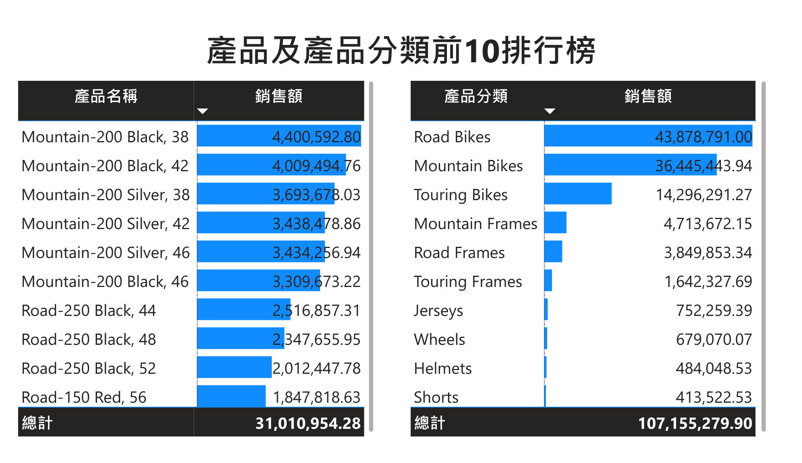 |

---

## 🛠 系統需求
* **Power BI Desktop** (建議更新至最新版本)
* 基礎 Excel/CSV 處理能力

---
感謝使用此專案！若有任何問題，歡迎透過 Issue 留言。
--------------------------------------------------
加上 個人github page
及 個人學習筆記